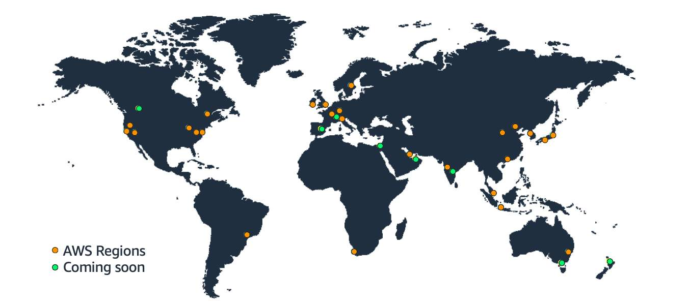

# ☁️ **AWS Global Infrastructure**

Infrastructure like data centers and networking still forms the **foundation of every cloud application** . 🏗️ In AWS, this physical infrastructure is called the **AWS Global Infrastructure** , consisting of:

- 🌎 **Regions**
- 🧩 **Availability Zones (AZs)**
- 📍 **Edge Locations**

---

## 🌍 **Regions**

- AWS spans **93 Availability Zones** across **29 geographic Regions** around the world (and counting!). 📈
- Each **Region** is a separate **geographic area** where AWS clusters multiple data centers.
- 🧭 Examples:
  - `us-east-1` → Northern Virginia 🇺🇸
  - `ap-northeast-1` → Tokyo 🇯🇵

➡️ You can select the Region you want in the AWS Console dropdown 🌐

### ✅ **Choosing the Right Region** — Consider:

1. ⏱️ **Latency** – Pick a Region closer to your users for better performance.
2. 💰 **Pricing** – Some Regions have cheaper resources.
3. 🧰 **Service Availability** – Not all AWS services are available in every Region.
4. 📜 **Compliance** – Choose based on data residency and regulatory needs.

---

## 🧩 **Availability Zones (AZs)**

- Each **Region** contains multiple **Availability Zones** .
- An **AZ** = 1 or more **data centers** with redundant power, networking, and connectivity ⚡🖧
- Example AZ codes:
  - `us-east-1a`
  - `sa-east-1b`

📍 AZs allow for **high availability** . If one AZ fails, another can take over.

✅ **Best practice:** Deploy workloads across **multiple AZs** to ensure **resilience** 🔁

---

## 🛠️ **Scope of AWS Services**

AWS services are offered at different levels of scope:

| Scope             | Level              | Example                   |
| ----------------- | ------------------ | ------------------------- |
| 🧭**Global**      | Across all Regions | IAM, Route 53, CloudFront |
| 📍**Regional**    | Specific Region    | S3, DynamoDB, Lambda      |
| 🧱**AZ-specific** | Specific AZ        | EC2, EBS                  |

🧠 Tip: Use **managed, Region-scoped services** for built-in resiliency where possible.

---

## ⚡ **Edge Locations**

- Over **400+ Edge Locations** globally 🌐
- 📦 Used by **Amazon CloudFront** to **cache content closer to users**
- Example use: Media in London cached in Sydney for faster delivery 🏃‍♂️💨

📈 When a user requests content:

1. CloudFront routes the request via AWS Backbone Network 🔁
2. Delivered from the **closest edge location** for low latency 🕒

---

## 📚 Resources

- [🌍 AWS Global Infrastructure](https://aws.amazon.com/about-aws/global-infrastructure/)
- [📄 AWS Global Infrastructure Documentation](https://docs.aws.amazon.com/global-infrastructure/latest/)
- [🗺️ AWS Regions and Availability Zones](https://aws.amazon.com/about-aws/global-infrastructure/regions_az/)
- [📌 AWS Service Endpoints](https://docs.aws.amazon.com/general/latest/gr/aws-service-information.html)
- [📍 Amazon CloudFront Guide](https://docs.aws.amazon.com/AmazonCloudFront/latest/DeveloperGuide/)
