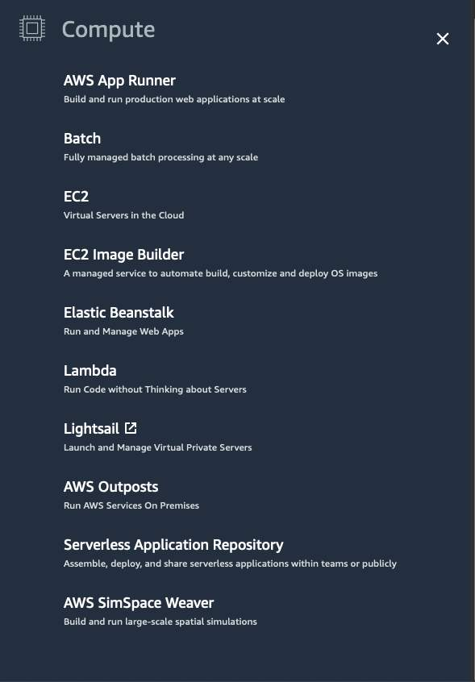
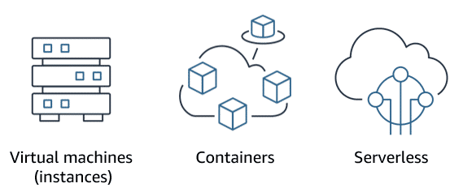

## ☁️ Compute as a Service (CaaS)

At the core of deploying applications in the cloud is  **compute power** —the ability to run code, serve requests, and perform processing. In AWS, this is broadly categorized into three types:

---

### 🔢 1. **Virtual Machines (VMs)**

🖥️  **Definition** : Emulates a physical server.

🔧  **How** : Uses a **hypervisor** to allocate physical resources to **virtual servers** (VMs).

📌  **Use Case** : Ideal when you need:

* Full control over OS and environment
* Long-running processes
* Custom networking/storage configurations

🚀  **AWS Service** : [Amazon EC2 (Elastic Compute Cloud)](https://aws.amazon.com/ec2/)

* Launch **EC2 instances** (virtual servers)
* Supports Windows & Linux OS
* AWS manages the physical host and virtualization layer

💡  **Cloud Insight** :

* Great for lift-and-shift migrations
* You handle patching, scaling, and high availability (unless you add services like Auto Scaling or ELB)

---

### 📦 2. **Container Services**

📂  **Definition** : Packages code and dependencies together in containers for consistent environments

⚙️  **How** : Uses a container engine (e.g., Docker) and orchestrators (e.g., Kubernetes, ECS, EKS)

📌  **Use Case** : Ideal for:

* Microservices architecture
* Dev/prod consistency
* Fast deployment and rollback

🚀  **AWS Services** :

* **Amazon ECS** (Elastic Container Service): AWS-managed container orchestration
* **Amazon EKS** (Elastic Kubernetes Service): Managed Kubernetes
* **AWS Fargate** : Serverless compute for containers (no EC2 needed)

💡  **Cloud Insight** :

* Containers are more lightweight and portable than VMs
* Fargate abstracts infrastructure management completely

---

### ⚡ 3. **Serverless Compute**

🧠  **Definition** : You write code, AWS runs it without provisioning servers

📌  **Use Case** :

* Event-driven applications
* APIs, automation tasks, lightweight data processing

🚀  **AWS Service** : [AWS Lambda](https://aws.amazon.com/lambda/)

* Run code in response to triggers (e.g., API Gateway, S3, DynamoDB)
* Charged per invocation and execution time

💡  **Cloud Insight** :

* Ideal for unpredictable traffic patterns
* No need to think about patching or scaling—it's fully managed

---

## 🧠 Key Takeaways

| Compute Type         | Control   | Management        | Best For                             |
| -------------------- | --------- | ----------------- | ------------------------------------ |
| **VMs (EC2)**  | High 🛠️ | Manual 🤹‍♂️   | Legacy apps, full control            |
| **Containers** | Medium 🧩 | Semi-managed ⚙️ | Microservices, CI/CD                 |
| **Serverless** | Low 🧬    | Fully managed 🧠  | Event-based workloads, quick deploys |

---

## 📚 Resources

* 📄 [AWS Compute Services Whitepaper]()
* 🌐 [AWS Compute Overview](https://aws.amazon.com/products/compute/)

---
