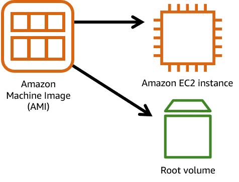

## 🌩️ **Amazon EC2 (Elastic Compute Cloud)**

### 🔹 **Overview**

* Amazon EC2 provides **secure, resizable compute capacity** in the cloud.
* Lets you launch **virtual servers** (called  **EC2 instances** ) in minutes.
* Offers control over  **CPU, memory, storage, and networking** .
* Pay-as-you-go pricing ⏳ (by the second or hour, min 60 sec).

---

### 🧱 **Building Blocks**

#### ⚙️ **Amazon Machine Image (AMI)**

* Blueprint used to launch EC2 instances.
* Contains:
  * 🖥️ OS (Linux, Windows, etc.)
  * 🗃️ Storage mappings
  * 🏗️ Architecture type (x86, ARM)
  * 🔐 Launch permissions
  * 📦 Preinstalled software

> 💡  **Analogy** :
>
> AMI = 📜Recipe | EC2 = 🎂Cake
>
> Class = 👨‍🏫 | Object = 👨‍🎓

#### 💽 **Hypervisor**

* Manages VMs on the host.
* AWS handles the underlying hardware and hypervisor management.

---

### ⚡ **EC2 Instance Lifecycle**

* Provision using:
  * 🖥️ AWS Console
  * 🔧 AWS CLI
  * 🧑‍💻 SDKs
  * 🤖 Automation (CloudFormation, Terraform)
* Choose:
  * 💻 Instance type (CPU, memory, network)
  * 🌐 Network location (AZ/VPC)
  * 🔥 Security (firewall rules, SSH keys)
  * 📦 OS & AMI

---

## 🏗️ **EC2 Instance Types**

Each instance type =

`<Family><Generation><Additional features>.<Size>`

 **Example** : `c5n.xlarge`

 

* `c`: Compute optimized
* `5`: 5th generation
* `n`: Extra features (e.g., enhanced networking)
* `xlarge`: Size

---

### 🧩 **Instance Families & Use Cases**

| 🏷️ Family            | 📌 Description                                 | 📈 Use Cases                         |
| ---------------------- | ---------------------------------------------- | ------------------------------------ |
| 🧪 General Purpose     | Balanced CPU, memory, network                  | Web apps, Dev/Test                   |
| 🧮 Compute Optimized   | High-performance CPU                           | HPC, ML Inference, Gaming            |
| 🧠 Memory Optimized    | Large in-memory processing                     | DBs, Caches, Big Data                |
| 🚀 Accelerated Compute | GPUs, FPGAs, custom chips                      | ML training, CFD, Speech Recognition |
| 🧾 Storage Optimized   | Fast, local storage IOPS                       | NoSQL, Analytics, Logs               |
| 📊 HPC Optimized       | Best price/performance for scale HPC workloads | Complex simulations, deep learning   |

> ✅ **Choose instance types based on workload characteristics.**
>
> Use Spot for cost savings, Reserved for long-term stability, and On-Demand for flexibility.

---

## 🌍 **EC2 Networking**

### 🛜 **Default VPC**

* Preconfigured network for launching public instances.
* ⚠️ Not secure for sensitive workloads—avoid storing customer data.

### 🌐 **Availability Zones (AZs)**

* Isolated data centers within a region.
* Use **multiple AZs for high availability** 🛡️.

---

## 🏗️ **High Availability (HA) Architecture**

> ☁️ "2 > 1, and 3 > 2"

### 📌 Recommendations:

* Use **2+ instances** in  **2+ AZs** .
* Spread workload for  **fault tolerance** .
* Prefer **more small instances** over fewer large ones to reduce risk of total failure.

---

## 🛠️ **AMI Categories in AWS**

| 📁 Category         | 🔍 Description                                |
| ------------------- | --------------------------------------------- |
| ⚡ Quick Start      | AWS-curated, ready to use AMIs                |
| 🛒 Marketplace      | Vendor-provided AMIs (open-source/commercial) |
| 🧑‍💻 My AMIs      | Your custom saved AMIs from running EC2s      |
| 🌍 Community AMIs   | Shared by the AWS user community              |
| 🏗️ Custom Builder | Built with EC2 Image Builder                  |

> 🆔 AMIs have unique region-based IDs like `ami-xxxx`.

---

## 🔐 **Security Best Practices**

* 📦 Use SSH key pairs for secure instance access.
* 🔥 Configure **Security Groups** and  **Network ACLs** .
* ⚠️ Don’t expose sensitive data in public VPC or unencrypted volumes.
* 🔁 Regularly update and patch AMIs and EC2 instances.

---

## 📘 **Extra Notes from Cloud Specialist Perspective**

✅  **Elasticity** :

Scale EC2 instances **horizontally (add more)** or **vertically (resize)** with ease.

✅  **Auto Scaling** :

Use **Auto Scaling Groups (ASGs)** to automatically manage capacity based on traffic load.

✅  **Cost Optimization** :

* Use **Spot Instances** for fault-tolerant, interruptible workloads.
* Use **Savings Plans or Reserved Instances** for predictable workloads.

✅  **Automation Tip** :

Use **EC2 Image Builder** + **CloudFormation/Terraform** for repeatable infrastructure.

✅  **Integration** :

EC2 integrates seamlessly with other AWS services like:

* 📦 EBS (storage)
* 📡 ELB (load balancing)
* 📊 CloudWatch (monitoring)
* 🔑 IAM (access control)

---
