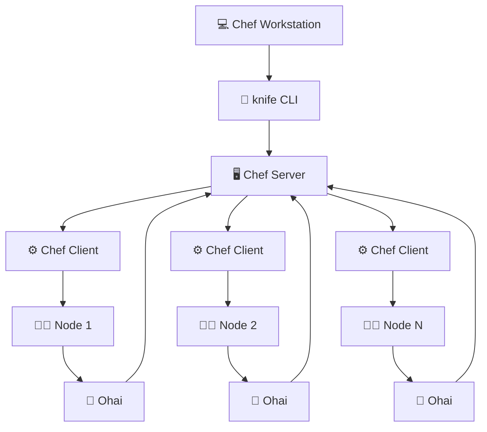

# 🏗️ **Chef - Architecture Overview**

👨‍🍳 **Chef** follows a **three-tier client-server model** for configuration management and automation.

---

## 🧩 **Chef Architecture Components**

### 💻 **1. Chef Workstation**

* 🏠 **Local machine** where:
  * 🧱 Cookbooks, Recipes, and other artifacts are  **developed** .
  * 🛠️ Uses **command-line tools** like `knife` to interact with the server.
* 📤 Uploads configurations to the  **Chef Server** .
* 📌 Primary  **developer interface** .

---

### 🖥️ **2. Chef Server**

* 🧠 Acts as the **central hub** of the Chef ecosystem.
* 🗂️ Stores all the uploaded  **Cookbooks** ,  **Policies** , and  **Metadata** .
* 🔁 Handles requests from **nodes** during Chef client runs.
* ☁️ Can be:
  * 🌐 **Hosted Chef Server** (SaaS)
  * 🏢 **On-premise Chef Server**

---

### 🖥️ **3. Chef Nodes**

* 🧑‍💻 Actual **target machines** (servers, VMs, containers, etc.) that:
  * Need to be **configured** and  **managed** .
* 🧩 Each node runs:
  * ⚙️ **Chef Client** → Talks to Chef Server.
  * 🧠 **Ohai** → Collects system info (CPU, Memory, OS, etc.).
* 🔄 Chef Client periodically:
  * 📥 Fetches **cookbooks**
  * 🛠️ Applies configurations
  * 📤 Sends status reports

---

## 🔁 **Chef Workflow Summary**

1. 🧑‍💻 **Write code** (recipes/cookbooks) on  **Chef Workstation** .
2. 🔪 Use **knife** to **upload** configurations to  **Chef Server** .
3. 🖥️ **Nodes** (with Chef client) **pull configs** and apply them.
4. 🧠 **Ohai** gathers node info and syncs with server.

---

### 📌 **Chef Communication Flow**

