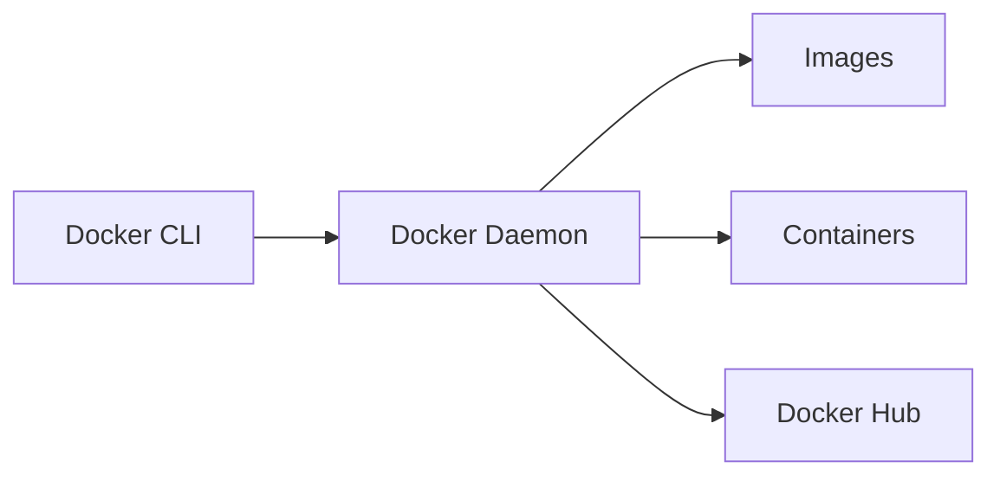

# 🐳 Docker Fundamentals

Welcome to the Docker Fundamentals guide! This document is perfect for beginners who want to understand **why Docker exists**, what problems it solves, and how it works under the hood.

---

## 📌 Table of Contents

- [🐳 Docker Fundamentals - Beginner Guide](#-docker-fundamentals---beginner-guide)
  - [📌 Table of Contents](#-table-of-contents)
  - [Why Docker? 🤔](#why-docker-)
    - [🛑 Problems Docker Solves:](#-problems-docker-solves)
    - [✅ With Docker:](#-with-docker)
  - [What is Docker? 🐳](#what-is-docker-)
  - [Containers vs Virtual Machines 🆚](#containers-vs-virtual-machines-)
  - [Docker Architecture 🧱](#docker-architecture-)
    - [🧩 Components:](#-components)

---

## Why Docker? 🤔

Before Docker, applications were difficult to **set up, scale, and deploy consistently** across environments.

### 🛑 Problems Docker Solves:

- **"It works on my machine!"** – Docker eliminates this by packaging dependencies and configuration together.
- Difficult and bulky **VM-based deployments**.
- Slow and resource-intensive CI/CD pipelines.
- Painful environment setup for developers.

### ✅ With Docker:

- **Consistent** environments from development to production.
- **Lightweight & fast** deployments.
- Easier to build, test, and ship applications.

---

## What is Docker? 🐳

**Docker** is an open-source platform that enables developers to **automate the deployment of applications inside lightweight, portable containers**.

A **container** is a standard unit of software that packages up code and all its dependencies so the application runs quickly and reliably in any environment.

> Think of Docker as a shipping container for software!

---

## Containers vs Virtual Machines 🆚

| Feature        | Virtual Machines (VMs)     | Containers                       |
| -------------- | -------------------------- | -------------------------------- |
| Boot Time      | Minutes                    | Seconds                          |
| Size           | GBs (includes OS)          | MBs (shares host OS)             |
| Performance    | Slower (emulates hardware) | Faster (uses host kernel)        |
| Isolation      | Strong (separate OS)       | Process-level isolation          |
| Portability    | Lower (OS-specific)        | High (runs anywhere Docker runs) |
| Resource Usage | High                       | Low                              |

---

## Docker Architecture 🧱

Docker uses a **client-server architecture**.

### 🧩 Components:

1. **Docker Client**Interacts with the Docker daemon via CLI or API.
2. **Docker Daemon (dockerd)**Responsible for building, running, and managing containers.
3. **Docker Images**Read-only templates used to create containers.
4. **Docker Containers**Runnable instances of Docker images.
5. **Docker Registries**
   Stores Docker images (e.g., Docker Hub).

 

---
