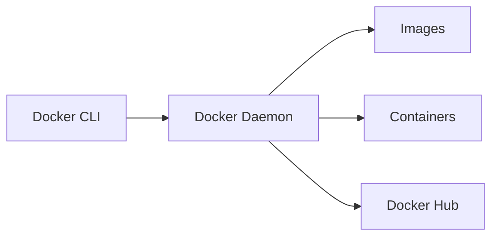

# 🐳 Docker Fundamentals - Beginner Guide

Welcome to the Docker Fundamentals guide! This document is perfect for beginners who want to understand **why Docker exists**, what problems it solves, and how it works under the hood.

---

## 📌 Table of Contents

- [🐳 Docker Fundamentals - Beginner Guide](#-docker-fundamentals---beginner-guide)
  - [📌 Table of Contents](#-table-of-contents)
  - [Why Docker? 🤔](#why-docker-)
    - [🛑 Problems Docker Solves:](#-problems-docker-solves)
    - [✅ With Docker:](#-with-docker)
  - [What is Docker? 🐳](#what-is-docker-)
  - [Containers vs Virtual Machines 🆚](#containers-vs-virtual-machines-)
  - [Docker Architecture 🧱](#docker-architecture-)
    - [🧩 Components:](#-components)
  - [Docker Images](#docker-images)
    - [Ways of Getting Docker Images](#ways-of-getting-docker-images)
    - [Docker Image Commands Table](#docker-image-commands-table)
    - [📌 Important Notes](#-important-notes)
  - [Docker Containers](#docker-containers)
    - [Docter Conatiner Lifecycle](#docter-conatiner-lifecycle)
    - [🔹 Created State](#-created-state)
    - [🔹 Started (Running) State](#-started-running-state)
    - [🔹 Paused State](#-paused-state)
    - [🔹 Exited State](#-exited-state)
    - [🔹 Dead State](#-dead-state)
    - [🧰 Docker Container Commands Table](#-docker-container-commands-table)
  - [📄 Dockerfile Overview](#-dockerfile-overview)
    - [🔹 Purpose of a Dockerfile](#-purpose-of-a-dockerfile)
    - [🔹 How It Works](#-how-it-works)
    - [📘 Dockerfile Instructions Table](#-dockerfile-instructions-table)
    - [Example of a Dockerfile](#example-of-a-dockerfile)
  - [Docker Image Layering and Caching](#docker-image-layering-and-caching)

---

## Why Docker? 🤔

Before Docker, applications were difficult to **set up, scale, and deploy consistently** across environments.

### 🛑 Problems Docker Solves:

- **"It works on my machine!"** – Docker eliminates this by packaging dependencies and configuration together.
- Difficult and bulky **VM-based deployments**.
- Slow and resource-intensive CI/CD pipelines.
- Painful environment setup for developers.

### ✅ With Docker:

- **Consistent** environments from development to production.
- **Lightweight & fast** deployments.
- Easier to build, test, and ship applications.

---

## What is Docker? 🐳

**Docker** is an open-source platform that enables developers to **automate the deployment of applications inside lightweight, portable containers**.

A **container** is a standard unit of software that packages up code and all its dependencies so the application runs quickly and reliably in any environment.

> Think of Docker as a shipping container for software!

---

## Containers vs Virtual Machines 🆚

| Feature        | Virtual Machines (VMs)     | Containers                       |
| -------------- | -------------------------- | -------------------------------- |
| Boot Time      | Minutes                    | Seconds                          |
| Size           | GBs (includes OS)          | MBs (shares host OS)             |
| Performance    | Slower (emulates hardware) | Faster (uses host kernel)        |
| Isolation      | Strong (separate OS)       | Process-level isolation          |
| Portability    | Lower (OS-specific)        | High (runs anywhere Docker runs) |
| Resource Usage | High                       | Low                              |


---

## Docker Architecture 🧱

Docker uses a **client-server architecture**.



### 🧩 Components:

1. **Docker Client**  
   Interacts with the Docker daemon via CLI or API.

2. **Docker Daemon (dockerd)**  
   Responsible for building, running, and managing containers.

3. **Docker Images**  
   Read-only templates used to create containers.

4. **Docker Containers**  
   Runnable instances of Docker images.

5. **Docker Registries**  
   Stores Docker images (e.g., Docker Hub).

<br>


---

## Docker Images

Docker images are read-only, self-contained templates used to build containers.

They use a layered file system where each layer represents a step, such as installing packages or copying files. This layering approach allows efficient reuse and caching, as only changed layers are rebuilt.

### Ways of Getting Docker Images

1. **Image from Docker Hub**  
   Docker Hub is the default registry for Docker images. You can pull public and private images from it.

   - **Pull a predefined (public) image from Docker Hub**

     ```bash
     docker pull <image-name>
     docker pull <image-name>:<version>
     ```

     Example:

     ```bash
     docker pull node
     docker pull node:18-alpine
     ```

   - **Pull a private image from Docker Hub**  
     First, authenticate with Docker Hub using your credentials:
     ```bash
     docker login
     docker pull username/image:tag
     ```

2. **Create an image from a Dockerfile**

   

   You can define a custom image using a `Dockerfile`. This file contains instructions like the base image, commands to run, files to copy, etc.  
   Example:

   ```bash
   docker build -t my-image-name:tag .
   ```

3. **Create an image from a Docker Container**
   You can create an image from a running or stopped container by committing its current state.

   Example:

   ```bash
   docker commit <container-id> my-image-name:tag
   ```

### Docker Image Commands Table

| Command                                | Description                                                 |
| -------------------------------------- | ----------------------------------------------------------- |
| `docker pull <image>`                  | Pulls an image from Docker Hub (latest tag by default).     |
| `docker image ls -q`                   | just display the Image IDs                                  |
| `docker pull <image>:<tag>`            | Pulls a specific version (tag) of the image.                |
| `docker push <image>:<tag>`            | Pushes an image to Docker Hub (requires login).             |
| `docker login`                         | Authenticates to Docker Hub.                                |
| `docker logout`                        | Logs out from Docker Hub.                                   |
| `docker images`                        | Lists all locally available Docker images.                  |
| `docker image ls`                      | Same as `docker images`.                                    |
| `docker image inspect <image>`         | Displays detailed info about an image.                      |
| `docker image history <image>`         | Shows history of an image's layers.                         |
| `docker rmi <image>`                   | Removes a specific Docker image.                            |
| `docker image rm <image>`              | Same as `docker rmi`.                                       |
| `docker tag <source> <target>`         | Tags an image with a new name or version.                   |
| `docker build -t <name>:<tag> .`       | Builds an image from a Dockerfile in the current directory. |
| `docker commit <container-id> <image>` | Creates a new image from a container's current state.       |
| `docker save -o <file>.tar <image>`    | Saves an image to a tar archive.                            |
| `docker load -i <file>.tar`            | Loads an image from a tar archive.                          |
| `docker image prune`                   | Removes unused images to free up space.                     |
| `docker rmi $(docker image ls -q)`     | Delete all docker images at once                            |
| `docker search <image-name>`           | Search images in Docker Hub                                 |

### 📌 Important Notes

- **Layer Caching:**  
  Docker uses layer caching to speed up image builds. If a Dockerfile instruction hasn't changed, Docker reuses the previously cached layer, significantly reducing build time.

- **Layers in Docker Images:**  
  Docker images are made of multiple layers, each created by a Dockerfile instruction (like `RUN`, `COPY`, etc.).

- **Immutability of Layers:**  
  Once a layer is built, it cannot be changed. This immutability allows Docker to efficiently reuse layers, saving both time and disk space.

---

## Docker Containers

A Docker container is a runtime instance of a Docker image. They are created by instantiating an image. Docker containers bundle an application along with all of its dependencies into a compact, lightweight package. By leveraging OS-level virtualization, containers can run reliably across a variety of environments.

### Docter Conatiner Lifecycle


Docker containers go through several states during their lifecycle. Understanding these states helps with effective container management and debugging.

### 🔹 Created State

- The container is created using `docker create`, but **not yet running**.
- Configuration, storage volumes, and network interfaces are allocated.
- No processes inside the container have started yet.

### 🔹 Started (Running) State

- Entered when the container is started using `docker start`.
- The container's main process begins execution.
- Actively uses system resources like CPU and memory.
- Runs the application or service defined in the image.

### 🔹 Paused State

- Triggered using `docker pause`.
- All processes in the container are **suspended**, halting execution.
- The container retains its memory and resources.
- Useful for temporary halts, debugging, or conserving resources.

### 🔹 Exited State

- The container’s main process has completed or crashed.
- Entered automatically when the container finishes its task or hits an error.
- Still retains its file system and settings.
- Can be restarted (`docker start`) or removed (`docker rm`).

### 🔹 Dead State

- Indicates a **critical failure** or abrupt termination.
- The container cannot be restarted.
- Docker daemon may attempt cleanup.
- Manual removal (`docker rm`) is required to free resources.

### 🧰 Docker Container Commands Table

| Command                             | Description                                                   |
| ----------------------------------- | ------------------------------------------------------------- |
| `docker create <image>`             | Creates a new container from an image without starting it.    |
| `docker run <image>`                | Creates and starts a container from an image.                 |
| `docker start <container>`          | Starts a previously created/stopped container.                |
| `docker stop <container>`           | Gracefully stops a running container.                         |
| `docker restart <container>`        | Stops and then starts the container again.                    |
| `docker pause <container>`          | Pauses all processes in the container.                        |
| `docker unpause <container>`        | Resumes all processes in a paused container.                  |
| `docker rm <container>`             | Removes a stopped container.                                  |
| `docker container prune`            | To remove all stopped container.                              |
| `docker rm $(docker ps -aq) `       | To remove all containers                                      |
| `docker kill <container>`           | Forcefully stops a container immediately.                     |
| `docker exec -it <container> <cmd>` | Runs a command inside a running container (interactive mode). |
| `docker attach <container>`         | Attaches terminal to a running container's STDIN/STDOUT.      |
| `docker logs <container>`           | Fetches logs from a container.                                |
| `docker ps`                         | Lists all **running** containers.                             |
| `docker ps -a`                      | Lists **all** containers (including stopped).                 |
| `docker inspect <container>`        | Displays detailed configuration of a container.               |
| `docker top <container>`            | Shows running processes in the container.                     |
| `docker stats`                      | Displays real-time resource usage statistics of containers.   |
| `docker rename <old> <new>`         | Renames an existing container.                                |
| `docker cp <container>:<src> <dst>` | Copies files/folders from a container to the host.            |
| `docker cp <src> <container>:<dst>` | Copies files/folders from the host to a container.            |

---

## 📄 Dockerfile Overview

A **Dockerfile** is a plain text document that contains a series of instructions used to build a Docker image. It defines everything needed to create a customized container environment.

### 🔹 Purpose of a Dockerfile

- Automates the process of building Docker images.
- Ensures consistency and reproducibility across environments.
- Makes deployment easier and more reliable.

### 🔹 How It Works

- The first instruction usually defines the **base image** (`FROM`).
- Additional commands are used to:
  - Install software
  - Copy files
  - Set environment variables
  - Run scripts

The final product is a Docker **image** — a self-contained executable package with everything required to run your application.

Dockerfiles are a core part of modern DevOps workflows, enabling clean and consistent application delivery.

### 📘 Dockerfile Instructions Table

| Instruction  | Description                                                                                            |
| ------------ | ------------------------------------------------------------------------------------------------------ |
| `FROM`       | Specifies the base image for the Docker image. Must be the first instruction.                          |
| `LABEL`      | Adds metadata to the image as key-value pairs.                                                         |
| `ENV`        | Sets environment variables inside the image.                                                           |
| `RUN`        | Executes commands in a new layer and commits the results. Often used to install packages.              |
| `CMD`        | Sets the default command to run when the container starts (can be overridden).                         |
| `ENTRYPOINT` | Configures a container to run as an executable. Cannot be overridden by command line arguments easily. |
| `COPY`       | Copies files and directories from the host into the container.                                         |
| `ADD`        | Similar to `COPY` but also supports remote URLs and unpacking compressed files.                        |
| `WORKDIR`    | Sets the working directory for `RUN`, `CMD`, `ENTRYPOINT`, `COPY`, and `ADD` instructions.             |
| `USER`       | Specifies the user to use when running the image.                                                      |
| `EXPOSE`     | Informs Docker that the container listens on the specified network ports at runtime.                   |
| `VOLUME`     | Creates a mount point and marks it as a volume to persist data.                                        |
| `ARG`        | Defines a build-time variable that users can pass at build-time.                                       |
| `ONBUILD`    | Adds a trigger instruction to be executed when the image is used as a base for another build.          |
| `SHELL`      | Overrides the default shell used for the `RUN` instructions.                                           |

### Example of a Dockerfile

```Dockerfile
# Use an official Node.js base image
FROM node:18-alpine

# Add metadata to the image
LABEL maintainer="pritam@example.com"
LABEL version="1.0"
LABEL description="Example Dockerfile using all major instructions"

# Define build-time variable (can be overridden with --build-arg)
ARG APP_ENV=production

# Set environment variables
ENV NODE_ENV=$APP_ENV
ENV PORT=3000

# Set working directory inside the container
WORKDIR /usr/src/app

# Copy application files from host to container
COPY package*.json ./

# Add a remote file (example use; not recommended for production)
ADD https://raw.githubusercontent.com/github/gitignore/main/Node.gitignore .gitignore

# Install dependencies
RUN npm install

# Copy the rest of the application code
COPY . .

# Create a volume to persist logs
VOLUME ["/usr/src/app/logs"]

# Expose the application port
EXPOSE $PORT

# Set default user
USER node

# Default command to run the app
CMD ["node", "index.js"]

# Alternative way to define entry point (more strict than CMD)
# ENTRYPOINT ["node", "index.js"]

# Define an on-build trigger (only relevant if this image is used as a base image)
ONBUILD COPY . /app
ONBUILD RUN npm install

# Override the default shell used for RUN commands
SHELL ["/bin/sh", "-c"]
```

---

## Docker Image Layering and Caching

---
